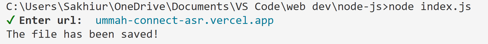

# Simple QR Code Generator

A minimal Node.js utility for generating QR codes interactively using terminal prompts.

## Features
- Generate SVG QR codes from any text or URL
- Interactive CLI using prompts
- Saves QR output and input history

## Tech Stack
- Node.js
- `qr-image` for QR generation
- `inquirer` for interactive CLI

## Usage
```bash
npm install
```
```bash
node index.js
```

## Demo


